# Adversary MCP Server

<div align="center">

[](https://badge.fury.io/py/adversary-mcp-server)
[](https://www.python.org/downloads/)
[](https://opensource.org/licenses/MIT)
[](https://github.com/brettbergin/adversary-mcp-server)
[](https://github.com/brettbergin/adversary-mcp-server)
[](https://pypi.org/project/adversary-mcp-server/)

**🔒 Enterprise-grade security analysis with AI-powered vulnerability detection and validation**

**We think about your vulns so you don't have to.**

[Installation](#installation) • [Quick Start](#quick-start) • [Cursor Setup](#cursor-ide-setup) • [CLI Usage](#cli-usage) • [MCP Tools](#mcp-tools) • [Architecture](#architecture)

</div>

---

## Features

- 🤖 **AI-Powered Analysis** - OpenAI/Anthropic LLM integration for intelligent vulnerability detection.
- 🎯 **Smart Validation** - Reduces false positives with LLM validation
- 🔍 **Multi-Engine Scanning** - Combines Semgrep static analysis & AI analysis
- 📊 **Interactive Dashboard** - Rich web-based telemetry with Chart.js visualizations and comprehensive analytics
- 🚀 **Git Diff Scanning** - Analyze only changed code for faster CI/CD integration
- 📦 **Monorepo Ready** - Optimized for large codebases with batch processing
- 📈 **Performance Telemetry** - Automatic tracking of all operations with SQLAlchemy backend

## Installation

### Prerequisites

- **Python 3.11+**
- **uv** - Modern Python package manager ([install](https://astral.sh/uv/))
- **Semgrep** - Static analysis engine ([install](https://semgrep.dev/docs/))

### Quick Install

```bash
brew install uv # macOS
brew install semgrep  # macOS
# or
pip install semgrep   # Other platforms

# Install Adversary MCP Server
uv pip install adversary-mcp-server
```

### Verify Installation

```bash
adv --version
adv status
```

## Quick Start

### Semgrep Setup
```bash
semgrep login
```
This next part is annoying but I recommend using semgrep to
scan a repository (safe-api, mercury, terra, etc) using
```bash
cd /path/to/repo && semgrep ci
```
This will download and cache the Semgrep Pro rulesets to use
our paid subscription. We will solve this in a later release.

### 1. Configure Security Engine

```bash
# Initial configuration
adv configure

# Set up AI provider (optional but recommended)
adv configure --llm-provider openai
# Enter your OpenAI API key when prompted

adv configure --llm-provider anthropic
# Enter your Anthropic API key when prompted

# Check configuration
adv status
```

### 2. Run Your First Scan

```bash
# Scan a single file
adv scan path/to/file.py

# Scan with AI validation (reduces false positives)
adv scan path/to/file.py --use-validation

# Scan entire directory
adv scan ./src --use-llm --use-validation
```

## Cursor IDE Setup

### Configure MCP Server

Create `.cursor/mcp.json` in your project:

```json
{
  "mcpServers": {
    "adversary": {
      "command": "uv",
      "args": ["run", "adversary-mcp-server"],
    }
  }
}
```

<details>
<summary>Alternative setups (click to expand)</summary>

#### Using pip installation:
```json
{
  "mcpServers": {
    "adversary": {
      "command": "python",
      "args": ["-m", "adversary_mcp_server.mcp_server_clean"],
    }
  }
}
```

#### For development:
```json
{
  "mcpServers": {
    "adversary": {
      "command": "/path/to/.venv/bin/python",
      "args": ["-m", "adversary_mcp_server.mcp_server_clean"]
    }
  }
}
```
</details>

### Using MCP Tools in Cursor

Once configured, these tools are available in Cursor's chat:

- **Ask Cursor**: "Scan this file for security issues using adv_scan_file"
- **Ask Cursor**: "Check for vulnerabilities in the current project with adv_scan_folder"
- **Ask Cursor**: "Show me security issues in recent changes using adv_diff_scan"

## CLI Usage

### Basic Commands

```bash
# Configure the scanner
adv configure

# Check status and configuration
adv status

# Scan files or directories
adv scan <path> [options]

# Launch comprehensive telemetry dashboard
adv dashboard

# Manage false positives
adv mark-false-positive <finding-id>
adv unmark-false-positive <finding-id>
```

### Scanning Examples

```bash
# Basic scan
adv scan app.py

# Scan with AI analysis and validation
adv scan ./src --use-llm --use-validation

# Scan only changed files (great for CI/CD)
adv diff-scan main feature-branch

# Output results as JSON
adv scan ./src --json --output results.json

# Scan with specific severity threshold
adv scan ./src --min-severity high
```

### Dashboard Commands

```bash
# Launch comprehensive telemetry dashboard
adv dashboard

# Dashboard for specific time period
adv dashboard --hours 72

# Generate dashboard without auto-launch
adv dashboard --no-launch

# Check telemetry system status
adv status
```

### Advanced Options

```bash
--use-llm              # Enable AI-powered vulnerability assessment
--use-validation       # Enable false positive filtering
--use-semgrep         # Use Semgrep rules (default: true)
--min-severity        # Filter by severity (low/medium/high/critical)
--json                # Output as JSON
--output <file>       # Save results to file
--include-stats      # Include performance metrics
```

## MCP Tools

### Available Tools

| Tool | Description | Example Usage |
|------|-------------|---------------|
| `adv_scan_code` | Scan code snippets | "Scan this code for vulnerabilities" |
| `adv_scan_file` | Scan specific files | "Check security issues in auth.py" |
| `adv_scan_folder` | Scan directories | "Analyze the src folder for vulnerabilities" |
| `adv_diff_scan` | Scan git changes | "Show security issues in recent commits" |
| `adv_configure_settings` | Update configuration | "Configure OpenAI for security scanning" |
| `adv_get_status` | Check server status | "Is the security scanner configured?" |
| `adv_mark_false_positive` | Mark false positives | "Mark finding XYZ as false positive" |

### MCP Tool Examples

```typescript
// In Cursor, ask the AI assistant:

// Scan current file
"Use adv_scan_file to check this file for security issues"

// Scan with validation
"Run adv_scan_file on auth.py with validation enabled"

// Check recent changes
"Use adv_diff_scan to analyze changes between main and my branch"

```

## Dashboard & Telemetry

### Comprehensive HTML Dashboard

The scanner includes a rich web-based dashboard for comprehensive telemetry analysis:

```bash
# Launch interactive dashboard
adv dashboard

# Open dashboard for specific time period
adv dashboard --hours 48

# Generate dashboard without auto-launch
adv dashboard --no-launch
```

**Dashboard Features:**
- 📊 **Interactive Charts** - Real-time performance metrics with Chart.js visualizations
- 🔍 **MCP Tool Analytics** - Track tool usage, success rates, and performance across Cursor IDE
- ⚡ **Scan Engine Metrics** - Monitor Semgrep, LLM, and validation performance
- 💾 **Cache Performance** - Analyze cache hit rates and efficiency
- 🎯 **Threat Analysis** - Categorize findings by severity and confidence
- 🏥 **System Health** - CPU, memory, and database performance monitoring
- 📈 **Language Performance** - Track scanning efficiency by programming language
- 🕒 **Recent Activity** - Timeline view of recent scans and operations

### Performance Metrics

Include `--include-stats` to see detailed metrics:

```json
{
  "performance_metrics": {
    "total_files": 200,
    "files_scanned": 200,
    "total_time": 45.2,
    "files_per_second": 4.42,
    "llm_usage": {
      "total_tokens": 125000,
      "total_cost": 0.38,
      "api_calls": 25
    }
  }
}
```

### Telemetry System

Adversary MCP Server includes comprehensive telemetry tracking:

- **Automatic Collection** - All MCP tools, CLI commands, and scan operations are automatically tracked
- **SQLAlchemy Backend** - Production-quality database with rich query capabilities
- **Zero Configuration** - Telemetry works out-of-the-box with no setup required
- **Privacy First** - All data stored locally, never transmitted to external services
- **Performance Insights** - Identify bottlenecks and optimize scanning workflows
- **Usage Analytics** - Understand tool usage patterns and effectiveness

## Architecture

### Clean Architecture Implementation

Adversary MCP Server is built using **Clean Architecture** principles with Domain-Driven Design (DDD), ensuring separation of concerns, maintainability, and testability.

```mermaid
graph TB
    subgraph "🖥️ **Presentation Layer**"
        A[Cursor IDE]
        B[CLI Interface]
        C[Web Dashboard]
    end

    subgraph "🔧 **Application Layer**"
        D[MCP Server]
        E[CLI Commands]
        F[Adapters]
        subgraph "Adapters"
            F1[SemgrepAdapter]
            F2[LLMAdapter]
            F3[ValidationAdapter]
        end
    end

    subgraph "🏛️ **Domain Layer (Business Logic)**"
        subgraph "Entities"
            G[ScanRequest]
            H[ScanResult]
            I[ThreatMatch]
        end
        subgraph "Value Objects"
            J[ScanContext]
            K[SeverityLevel]
            L[ConfidenceScore]
            M[FilePath]
        end
        subgraph "Domain Services"
            N[ScanOrchestrator]
            O[ThreatAggregator]
            P[ValidationService]
        end
        subgraph "Interfaces"
            Q[IScanStrategy]
            R[IValidationStrategy]
        end
    end

    subgraph "⚙️ **Infrastructure Layer**"
        S[SemgrepScanner]
        T[LLMScanner]
        U[LLMValidator]
        V[SQLAlchemy Database]
        W[File System]
        X[Git Operations]
        Y[Telemetry System]
    end

    A -->|MCP Protocol| D
    B --> E
    C --> Y

    D --> F
    E --> F
    F1 --> N
    F2 --> N
    F3 --> P

    N --> O
    N --> P

    G --> N
    H --> O
    I --> P
    J --> G
    K --> I
    L --> I
    M --> G

    N --> Q
    P --> R

    F1 -.-> S
    F2 -.-> T
    F3 -.-> U

    S --> W
    T --> W
    U --> V
    Y --> V
    X --> W

    style N fill:#e1f5fe,stroke:#0277bd,stroke-width:3px
    style O fill:#e1f5fe,stroke:#0277bd,stroke-width:3px
    style P fill:#e1f5fe,stroke:#0277bd,stroke-width:3px
    style G fill:#f3e5f5,stroke:#7b1fa2,stroke-width:2px
    style H fill:#f3e5f5,stroke:#7b1fa2,stroke-width:2px
    style I fill:#f3e5f5,stroke:#7b1fa2,stroke-width:2px
    style F1 fill:#e8f5e8,stroke:#388e3c,stroke-width:2px
    style F2 fill:#e8f5e8,stroke:#388e3c,stroke-width:2px
    style F3 fill:#e8f5e8,stroke:#388e3c,stroke-width:2px
```

<div align="center">



</div>

### Clean Architecture Benefits

1. **🎯 Separation of Concerns**: Business logic isolated from infrastructure
2. **🔧 Dependency Inversion**: High-level modules don't depend on low-level details
3. **🧪 Testability**: Pure domain logic enables comprehensive unit testing
4. **🔄 Maintainability**: Changes to infrastructure don't affect business rules
5. **📈 Scalability**: New scan strategies and validators easily pluggable
6. **🛡️ Type Safety**: Rich domain models with comprehensive validation

### Architectural Layers

#### 🏛️ **Domain Layer** (Core Business Logic)
- **Entities**: `ScanRequest`, `ScanResult`, `ThreatMatch` - Rich business objects
- **Value Objects**: `ScanContext`, `SeverityLevel`, `ConfidenceScore`, `FilePath` - Immutable domain concepts
- **Domain Services**: `ScanOrchestrator`, `ThreatAggregator`, `ValidationService` - Pure business orchestration
- **Interfaces**: `IScanStrategy`, `IValidationStrategy` - Contracts for external dependencies

#### 🔧 **Application Layer** (Use Cases & Coordination)
- **MCP Server**: Handles Cursor IDE integration via Model Context Protocol
- **CLI Commands**: Command-line interface for security scanning operations
- **Adapters**: Bridge domain interfaces with infrastructure implementations
  - `SemgrepAdapter` - Adapts Semgrep scanner to domain `IScanStrategy`
  - `LLMAdapter` - Adapts LLM scanner to domain `IScanStrategy`
  - `ValidationAdapter` - Adapts LLM validator to domain `IValidationStrategy`

#### ⚙️ **Infrastructure Layer** (External Services)
- **SemgrepScanner**: Static analysis engine integration
- **LLMScanner**: AI-powered vulnerability detection
- **LLMValidator**: False positive filtering with LLM analysis
- **SQLAlchemy Database**: Persistent storage for telemetry and results
- **File System**: Code file access and Git operations
- **Telemetry System**: Performance tracking and dashboard generation

### Data Flow Architecture

1. **Input Processing**: `ScanRequest` created with `ScanContext` (file/directory/code)
2. **Domain Orchestration**: `ScanOrchestrator` coordinates scanning strategies
3. **Parallel Analysis**: Multiple `IScanStrategy` implementations execute concurrently
4. **Threat Aggregation**: `ThreatAggregator` deduplicates and merges findings
5. **Validation Pipeline**: `ValidationService` filters false positives using AI
6. **Result Assembly**: Rich `ScanResult` with comprehensive metadata
7. **Presentation**: Results formatted for CLI, MCP, or dashboard consumption

### Key Design Patterns

- **Strategy Pattern**: Pluggable scan and validation strategies
- **Adapter Pattern**: Infrastructure integration without domain coupling
- **Factory Pattern**: Bootstrap and dependency injection
- **Value Objects**: Immutable domain concepts with validation
- **Domain Services**: Complex business logic coordination

### How It Works

1. **🔍 Multi-Engine Analysis**: Parallel execution of Semgrep static analysis and LLM AI analysis
2. **🧠 Intelligent Validation**: LLM-powered false positive reduction with confidence scoring
3. **📊 Threat Aggregation**: Smart deduplication and merging using fingerprint and proximity strategies
4. **⚡ Performance Optimization**: Async processing, caching, and batch operations
5. **📈 Comprehensive Telemetry**: SQLAlchemy-backed metrics with interactive Chart.js dashboard
6. **🔄 Git Integration**: Diff-aware scanning for efficient CI/CD pipeline integration
7. **🎛️ Zero-Config Operation**: Auto-discovery and configuration with sensible defaults

## Configuration

### Environment Variables

```bash
# Core settings
ADVERSARY_WORKSPACE_ROOT=/path/to/project
ADVERSARY_LOG_LEVEL=INFO

# LLM Configuration (optional)
ADVERSARY_LLM_PROVIDER=openai
ADVERSARY_LLM_MODEL=gpt-4-turbo-preview

# Performance tuning
ADVERSARY_MAX_CONCURRENT_SCANS=8
ADVERSARY_CACHE_SIZE_MB=200
```

### Configuration File

Settings are stored in `~/.adversary/config.json`:

```json
{
  "llm_provider": "openai",
  "enable_validation": true,
  "severity_threshold": "medium",
  "enable_caching": true,
  "telemetry_enabled": true,
  "dashboard_auto_launch": true
}
```

### Dashboard Configuration

The telemetry system creates a unified SQLAlchemy database at:
- **Location**: `~/.local/share/adversary-mcp-server/cache/adversary.db`
- **Migration**: Existing JSON metrics automatically migrated on first dashboard use
- **Retention**: Data retained indefinitely for historical analysis (configurable)

```bash
# Check telemetry status
adv status

# Manually run migration (if needed)
python -m adversary_mcp_server.migration.database_migration
```

## CI/CD Integration

### GitHub Actions

```yaml
name: Security Scan
on: [pull_request]

jobs:
  security:
    runs-on: ubuntu-latest
    steps:
      - uses: actions/checkout@v3

      - name: Install dependencies
        run: |
          pip install uv
          uv pip install adversary-mcp-server

      - name: Run security scan
        run: |
          adv diff-scan origin/main HEAD \
            --use-validation \
            --min-severity medium \
            --json \
            --output scan-results.json

      - name: Upload results
        uses: actions/upload-artifact@v3
        with:
          name: security-scan
          path: scan-results.json
```

## Development

### Setup Development Environment

```bash
# Clone repository
git clone https://github.com/brettbergin/adversary-mcp-server.git
cd adversary-mcp-server

# Create virtual environment with uv
uv venv
source .venv/bin/activate  # or `.venv\Scripts\activate` on Windows

# Install in development mode
uv pip install -e .[dev]

# Run tests
make test

# Run with live reload
make dev
```

### Running Tests

```bash
# Full test suite (includes telemetry and dashboard tests)
make test

# Quick tests (no coverage)
make test-fast

# Specific test modules
pytest tests/test_scanner.py -v
pytest tests/test_telemetry_system.py -v
pytest tests/test_dashboard_system.py -v

# Run only integration tests
make test-integration

# Run security-specific tests
make test-security
```

## Support

- 📖 [Documentation](https://github.com/brettbergin/adversary-mcp-server/wiki)
- 🐛 [Report Issues](https://github.com/brettbergin/adversary-mcp-server/issues)
- 💬 [Discussions](https://github.com/brettbergin/adversary-mcp-server/discussions)
- 📧 Contact: brettbergin@gmail.com

## License

MIT License - see [LICENSE](LICENSE) for details.

## Contributing

Contributions are welcome! Please see our [Contributing Guide](CONTRIBUTING.md) for details.

---

<div align="center">
Made with ❤️ for software security.
</div>
